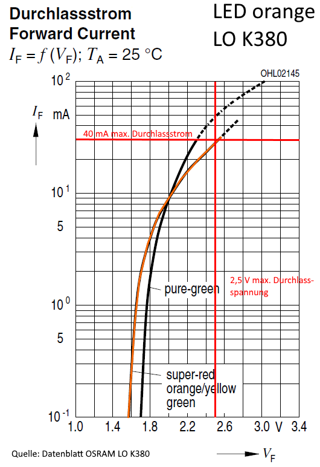
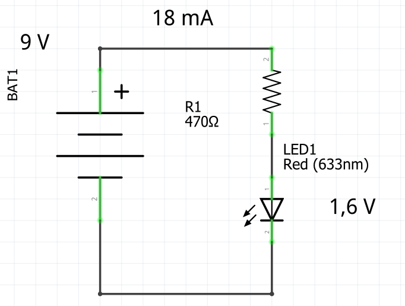

# lernpaket_elektronik
Mit Franzis Lernpaket Elektronik realisierbare Schaltungen

## Bauteilliste

### Widerstände
* 2 x 470 Ohm
* 2 x 1 kOhm
* 2 x 10 kOhm
* 2 x 100 kOhm
* 2 x 1 MOhm

### Widerstand lichtempfindlich
* 1 x Fotowiderstand

### Kondensatoren
* 1 x 10 nF
* 1 x 100 nF
* 1 x 22 µF
* 2 x 100 µF

### Halbleiter
* 1 * grüne LED
* 1 * rote LED
* 10 * orange LEDs
* 2 x Dioden 1N4148
* 2 x npn-Transistoren BC547
* 1 x pnp-Transistor BC557
* 1 x 2-fach Operationsverstärker LM358
* 1 x Timer NE555

### Sonstiges
* 1 x Piezo-Schallwandler
* 1 x Taster

## LED orange OSRAM LO K380
Kriterium         | typisch | max.
------------------|---------|------
Durchlassstrom    |         | 40 mA
Durchlassspannung | 2,1 V   | 2,5 V
Sperrspannung     |         | 12 V 

## Schaltung LED mit Vorwiderstand
Bei dieser einfachen Schaltung wird mit einem Halbleiter, die LED, gearbeitet. Obwohl diese recht simple aussieht, hat ja nur zwei Beine, passiert in der LED jede Menge Physik. Da eine LED einer Diode ähnlich ist, außer dass die aus anderem Hableitern besteht und erst dadurch Licht abgeben kann, hilft vielleicht dieses [YouTube-Video zur Arbeitsweise einer Diode] von TheSimplePhysics.

Die rote LED ist eine Standard 5 mm LED die bei einem typischen Durchlassstrom 20 mA ein gut sichtbares rotes Licht erzeugt. 

Die Durchlassspannung einer roten LED beträgt ungefähr 1,6 V. 

In dem [Wikipedia-Artikel zur LED] ist wunderschön der Zusammenhang zwischen der 
Farbe der LED (genauer der Wellenlänge) und der Durchlassspannung als Diagramm [1] dargestellt:

Betriebsspannung ist durch die 9V Batterie logischerweise etwa 9 V (maximal).
Die LED und der Widerstand stellen eine Reihenschaltung dar. Die Betriebsspannung teilt sich in einem Spannungsabfall über den Widerstand und einem Spannungsabfall über die LED auf. Der Spannungsabfall über die LED wird Durchlassspannung genannt. Der Spannungsabfall über den Widerstand ergibt sich aus Batteriespannnung minus der Durchlassspannung: 9 V - 1,6 V = 8,4 V.

Mit Hilfe des Ohmschen Gesetzes läßt sich nun der Widerstand bestimmen:

R = U / I

R = 8,4 V / 18 mA

R = 0,470 kOhm = 470 Ohm

Erhöht man den Widerstand z.B. auf 1kOhm, dann leuchtet die LED schwächer, denn der Lichtstrom einer LED ist nahezu proportional zum Betriebsstrom. Auch dazu gibt es in dem [Wikipedia-Artikel zur LED] ein anschauliches Diagramm [2] zur Abhängigkeit des Lichtstroms vom Durchlassstrom:

Der Vorwiderstand ist ein Widerstand von 470 Ohm, der in der sogenannten E-24 Reihe als Wert vorkommt. Daher gibt es diesen Widerstand als sehr preiswerten Kohle-schichtwiderstand und hat 0,25 W maximale Verlustleistung. Wenn man mit der Formel P = U * I die Leistung bei einem Strom von 18 mA bestimmt, dann erhält man:

P = U * I

P = 8,4 V * 18 mA

P = 151,2 mW

Die Leistung liegt damit unter der maximalen Verlustleistung und soll dadurch nicht verschmoren.

## Quellen

[1]: By Dantor (Own work) [CC BY-SA 3.0 (https://creativecommons.org/licenses/by-sa/3.0)], via Wikimedia Commons

[2]: By Ulfbastel (Own work) [GFDL (http://www.gnu.org/copyleft/fdl.html) or CC BY-SA 4.0-3.0-2.5-2.0-1.0 https://creativecommons.org/licenses/by-sa/4.0-3.0-2.5-2.0-1.0)], via Wikimedia Commons

## Interessante Links
[Wikipedia-Artikel zum Widerstand]

[Sparkfun-Tutorial zum Multimeter]

[Git-Buch]

[YouTube-Video zur Arbeitsweise einer Diode]: https://www.youtube.com/watch?v=MSncOmacDJ0&index=11&list=PLpVnboFaviRH32427m_mNSDHRMcEZ347h
[Wikipedia-Artikel zur LED]: https://de.wikipedia.org/wiki/Leuchtdiode
[Wikipedia-Artikel zum Widerstand]: https://de.wikipedia.org/wiki/Widerstand_(Bauelement)
[Sparkfun-Tutorial zum Multimeter]: https://learn.sparkfun.com/tutorials/how-to-use-a-multimeter
[Git-Buch]: https://git-scm.com/book/de/v1